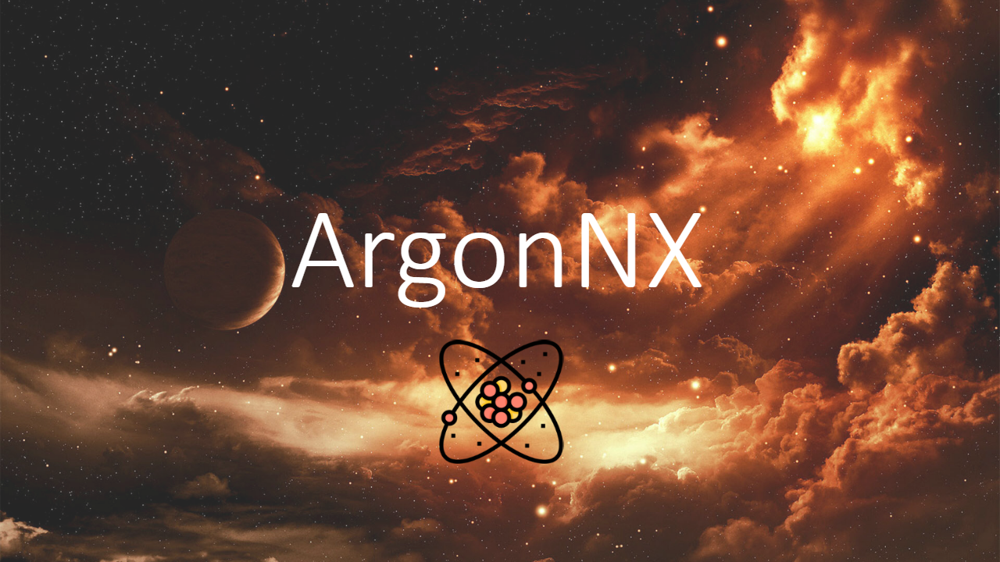

## What Argon is?

Argon is a noble gas.
"Argon" comes from Greek "Argon", neuter of "argos" meaning *lazy* , *idle* or *inactive*.
Argon recieved this name because its chemical inactivity.

Argon NX is an immutable payload which is injected to your Nintendo Switch via Fusee Gelee exploit.

## Purpose 

The purpose of Argon NX is to stay immutable, so you can always inject it, without caring about other payloads getting updated (Always use ArgonNX for TegraSmash, TegraGUI, TrinkedM0 ...).

## How can it be?

When Argon NX is injected it automatically launches the `payload.bin` loacted at `argon` directory on your SD Card root. 

If `payload.bin` is not present or VOOLUME DOWN button is pressed on payload injection, Argon NX will list all payloads located at `argon/payloads`, and you will be able tp select one of theme to launch it.

If you want, you can choose a payload logo by adding a **32 argb bmp(200*200) file named as the payload** to `argon/logos` directory.

Example:
```
argon
  ├───logos
  │     default.bmp       # Default logo
  │     fusee-primary.bmp # Logo for fusee-primary.bin payload
  │
  └───payloads
        fusee-primary.bin
        ReiNX.bin         # Will be rendered using default logo
```

## GUI


The sd card files of the image are:
```
argon
├───payloads
│       fusee-primary.bin
│       ReiNX.bin
│       fusee.bin
│       hekate.bin
│       payload1.bin
│       payload2.bin
│       payload3.bin
│       payload4.bin
│
└───logos
        fusee-primary.bmp
        default.bmp
        Reinx.bmp
        hekate.bmp
        fusee.bmp
```

## Compatibility

Works with all cfw payloads. 
Not tested with TeamXecuter SXOS payloat but it should work too.

## Roadmap

1. Touch input
2. Kind of config file
3. Change font
4. More generic Makefile
5. A lot more

## Credits

* __devkitPro__ for the [devkitA64](https://devkitpro.org/) toolchain and libnx support.
* __naehrwert__ and __st4rk__ for the original [hekate](https://github.com/nwert/hekate) project and its hwinit code base.
* __CTCaer__ for the continued [hekate](https://github.com/CTCaer/hekate).
* __SciresM__, __TuxSH__ and __hexkyz__ for the base hwinit code of Argon NX

