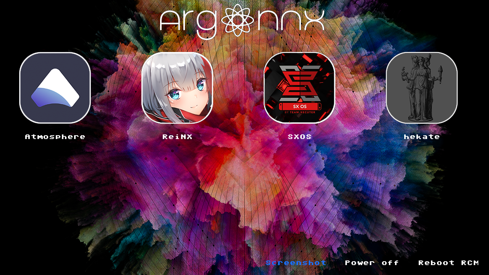

[](https://www.switchbru.com/appstore/#/app/argon-nx)

## What Argon is?

Argon is a noble gas.
"Argon" comes from Greek "Argon", neuter of "argos" meaning *lazy* , *idle* or *inactive*.
Argon recieved this name because of its chemical inactivity.

Argon NX is an immutable payload which is injected to your Nintendo Switch via Fusee Gelee exploit.

## Purpose 

The purpose of Argon NX is to stay immutable, so you can always inject it, without caring about other payloads getting updated (Always use ArgonNX for TegraSmash, TegraGUI, TrinkedM0...).

## How can it be immutable?

When Argon NX is injected, it automatically launches the `payload.bin` loacted at `argon` directory on your SD Card root. 

If `payload.bin` is not present or VOLUME DOWN button is pressed on payload injection, Argon NX will list all payloads located at `argon/payloads`, and you will be able to select one of them to launch it.

## Features

- **Autolaunch/autochainload** the payload named `payload.bin` inside `argon` directory in your sd card root.
- If `argon/payload.bin` is not found or `VOLUME_DOWN_BUTTON` is held during ArgonNX injection, ArgonNX will list all the payloads located at `argon/payloads`, so you can select one of them to launch it.
- **Customize payloads' logos**. **Logos must be smaller or equal than 200x200**. Example:
```
argon
  ├───logos
  │     fusee-primary.bmp # Logo for fusee-primary.bin payload
  │     ReiNX.bmp # Logo for ReiNX.bin payload
  │
  └───payloads
        fusee-primary.bin
        ReiNX.bin         
        hekate.bin # Will be rendered using default logo
```

- **Custom backgrounds** can be added by placing `background.bmp` file inside `argon` directory. **The background must be smaller or equal than 1280x720**.
- Take **screenshots** to share your ArgonNX gui. To capture ArgonNX screen tap anywhere with two fingers.
- Touch support. Thanks to @pixel-stuck
- Simple tools. (Don't expect tools like the onew built in hekate, argon tools are much more lightweighted and simple, such as reboot options)

## About BMP format

The only format supported is **BMP 32 bit ARGB color**.
ArgonNX recomnds to use a solid background without alpha channel (alpha channel set to 0xFF). Payloads' logos **support alpha channel**.

## GUI

This image was captured with the **screenshot** feature.



Find these logos [here](img/example-logos) and the background and title [here](sd-card-example/).

The layout of files on the sd card for this image:
```
argon
├─── payloads
│       Atmosphere.bin
│       ReiNX.bin
│       fusee-gelee.bin
│       hekate.bin
│       SXOS.bin
│
├─── logos
|       Atmosphere.bmp
|       Reinx.bmp
|       hekate.bmp
|       SXOS.bmp
|
├─── sys
|       minerva.bso # IMPORTANT if you want a good UX experience
|       resources.argon # IMPORTANT. Binary file containing all render resources except the background and logos
|
└─── background.bmp
```

## Improve performance

ArgonNX can use **minerva dram training** to improve performance.
The use of minerva is optional but recommended. To use minerva just place the compiled `minerva.bso` inside `argon/sys`. The directory `argon/sys` with minerva, is included in `sd-files.zip` in the release section.

To learn more about Minerva Training Cell check its [official repo](https://github.com/CTCaer/minerva_tc).

## Compatibility

This payload will chainload any CFW or payload. 

Some users reported issuses using SX OS. <small>But with Atmosphere out there... who wants SXOS?</small>

## Roadmap

1. Config file to manage tabs titles and argon sd card directory tree.
2. More tools inside tools tab.

## Credits

* __devkitPro__ for the [devkitA64](https://devkitpro.org/) toolchain.
* __naehrwert__ and __st4rk__ for the original [hekate](https://github.com/nwert/hekate) project and its hwinit code base.
* __CTCaer__ for the continued [hekate](https://github.com/CTCaer/hekate) and his **minerva** project.
* __xalgovia__ and __Retrogamer 74__ for the splash and logos. Also thanks them to use ArgonNX in RetroReloaded.
* __langerhans__ and  __stuck-pixel__ for their implementation of touch support.
* __LittlevGL__ for being such a good embedded graphics library.
* __D3fau4__ for touch support testing.
